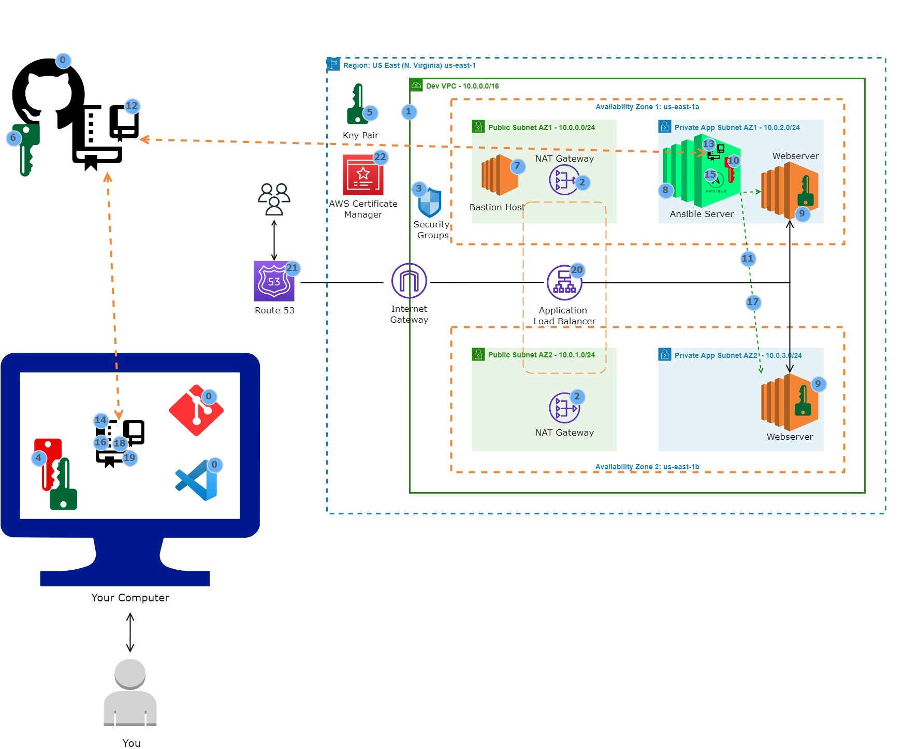

# Static Website Deployment on AWS with Ansible 

## 1. Project Overview
This project demonstrates the deployment of a static website on AWS using Ansible. It highlights the automation of the deployment process on EC2 instances, leveraging various AWS services and Ansible's powerful configuration management capabilities.

## 2. Architecture
The architecture involves a VPC with public and private subnets across two availability zones. Key components include:
- **VPC Setup:** With public and private subnets in two availability zones.
- **Public Resources:** NAT Gateways, Bastion Host, and Application Load Balancer in public subnets.
- **Security:** Security Groups for firewall rules.
- **EC2 Instances:** Ansible Server in a private subnet and WebServers in both subnets.
- **Load Balancer:** Application Load Balancer to distribute traffic.
- **Route 53 & AWS Certificate Manager:** For domain name registration and SSL certification.

## 3. Deployment Script
The deployment involves several Ansible scripts and configuration files:
- **Ansible Config (ansible.cfg):** Basic Ansible configurations.
- **Deployment Playbook (deploy-jupiter-website.yml):** Main playbook for website deployment.
- **Inventory File:** Defines the hosts and groups for Ansible.

## 4. Deployment Steps
1. **Environment Setup:** Install Git, Visual Studio Code, and register for GitHub and AWS accounts.
2. **Key Pair Creation:** Generate and import key pairs in AWS and GitHub.
3. **Clone Repository:** Clone the project's GitHub repository to both your local machine and the Ansible Server.
4. **Ansible Installation:** Install Ansible on the Ansible Server.
5. **Ansible Configuration:** Create and push the Ansible inventory file and config file to GitHub.
6. **Ansible Playbook Execution:** Run the Ansible playbook to deploy the website.
7. **Connection Testing:** Test connections between Ansible Server and Webservers, and the load balancer setup.

## 5. Repository Structure and Link
The GitHub repository includes:
- **Ansible Configuration Files:** ansible.cfg, inventory.
- **Deployment Playbook:** deploy-jupiter-website.yml.
- **Reference Architecture Diagram:** Ansible_Reference_Architecture.jpg.

[GitHub Repository Link](#)

## 6. Additional Resources and Link
- **Ansible Documentation:** Detailed guides and tutorials on Ansible usage.
- **AWS Documentation:** Comprehensive information on AWS services used in the project.

[Ansible Documentation](https://docs.ansible.com/)
[AWS Documentation](https://aws.amazon.com/documentation/)

